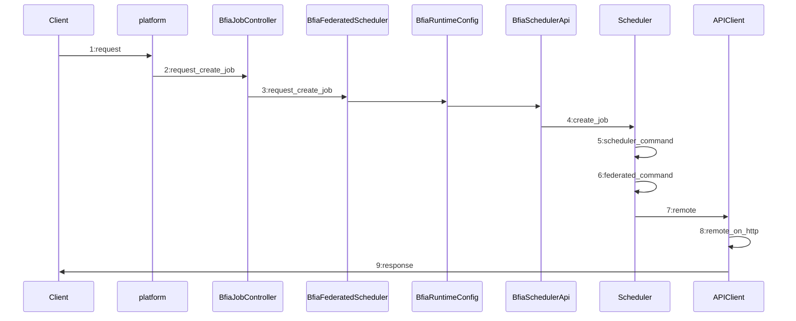
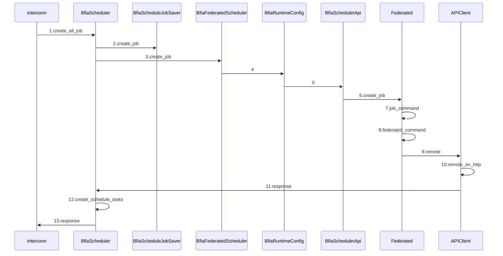

# data upload

接口实现在：`fate_flow/apps/client/data_app.py`

## 客户端-服务器不分离

接口`v2/component/upload`

```json
{
  "file": "examples/data/breast_hetero_guest.csv",
  "head": true,
  "partitions": 16,
  "extend_sid": true,
  "meta": {
    "delimiter": ",",
    "label_name": "y",
    "match_id_name": "id"
  },
  "namespace": "experiment",
  "name": "breast_hetero_guest"
}
```

- file: 文件路径
- head: 数据是否携带header: true/false
- partitions: 数据存储分区数量
- extend_sid：是否需要生成sid列
- meta：数据的元信息
- namespace && name: 数据在fate的存储表引用

> 在请求体中(json)指定文件路径，这个文件路径是服务器的路径，也就是说文件必须在服务器中存在

## 客户端-服务器分离

这种方式就是form-data方式把文件传到服务器端
除了file的区别，其它的key-value和上一种方式一致

# create job(submit job)

## platform 相关接口（发起方）

请求包：

```json
{
    "flow_id": "JG0100001100000000",
    "dag": {
        "components": [
            {
                "name": "intersect_rsa_1",
                "componentName": "Intersection",
                "provider": "unionpay",
                "version": "2.0.0",
                "input": [],
                "output": [
                    {
                        "type": "dataset",
                        "key": "train_data"
                    },
                    {
                        "type": "report",
                        "key": "report0"
                    }
                ]
            },
            {
                "name": "hetero_secureboost_1",
                "componentName": "HeteroSecureBoost",
                "provider": "unionpay",
                "version": "2.0.0",
                "input": [
                    {
                        "type": "dataset",
                        "key": "intersect_rsa_1.train_data"
                    }
                ],
                "output": [
                    {
                        "type": "dataset",
                        "key": "data0"
                    },
                    {
                        "type": "model",
                        "key": "model0"
                    },
                    {
                        "type": "report",
                        "key": "report0"
                    },
                    {
                        "type": "report",
                        "key": "report1"
                    },
                    {
                        "type": "report",
                        "key": "report2"
                    }
                ]
            }
        ],
        "version": "2.0"
    },
    "config": {
        "initiator": {
            "role": "guest",
            "node_id": "JG0100001100000010"
        },
        "role": {
            "guest": [
                "JG0100001100000010"
            ],
            "host": [
                "JG0100001100000010"
            ]
        },
        "job_params": {
            "common": {
                "sync_type": "poll"
            },
            "guest": {
                "0": {
                    "resources": {
                        "cpu": -1,
                        "memory": -1,
                        "disk": -1
                    }
                }
            },
            "host": {
                "0": {
                    "resources": {
                        "cpu": -1,
                        "memory": -1,
                        "disk": -1
                    }
                }
            }
        },
        "task_params": {
            "common": {
                "hetero_secureboost_1": {
                    "id": "id",
                    "label": "y",
                    "learning_rate": 0.5,
                    "objective_param": {
                        "objective": "cross_entropy"
                    },
                    "num_trees": 2,
                    "subsample_feature_rate": 1,
                    "n_iter_no_change": "True",
                    "tol": 0.0001,
                    "predict_param": {
                        "threshold": 0.5
                    },
                    "cv_param": {
                        "n_splits": 5,
                        "shuffle": false,
                        "random_seed": 103,
                        "need_cv": false
                    },
                    "metrics": [
                        "auc",
                        "ks"
                    ],
                    "early_stopping_rounds": "",
                    "tree_param": {
                        "max_depth": 5
                    }
                },
                "intersect_rsa_1": {
                    "id": "id",
                    "intersect_method": "rsa",
                    "sync_intersect_ids": true,
                    "only_output_key": false,
                    "rsa_params": {
                        "hash_method": "sha256",
                        "final_hash_method": "sha256",
                        "key_length": 2048
                    }
                }
            },
            "guest": {
                "0": {
                    "intersect_rsa_1": {
                        "dataset_id": "testspace#test_guest"
                    }
                }
            },
            "host": {
                "0": {
                    "intersect_rsa_1": {
                        "dataset_id": "testspace#test_host"
                    }
                }
            }
        },
        "version": "2.0.0"
    }
}
```

返回包：

```json
{
    "code": 0,
    "data": {
        "job_id": "202403211636244626050"
    },
    "msg": "success"
}
```



1. 由客户端发起http请求创建job
2. 接口实现：`fate_flow/adapter/bfia/apps/platform_app.py`中`/v1/platform/schedule/job/create_all`，这个接口中调用BfiaJobController的request_create_job类方法
3. BfiaFederatedScheduler的类方法request_create_job中通过BfiaRuntimeConfig获取到BfiaSchedulerApi对象，BfiaSchedulerApi对象的scheduler属性，返回一个scheduler对象.
4. 再使用这个scheduler对象调用create_job，在这一步指定endpoint，为 `/v1/interconn/schedule/job/create_all`
5. scheduler_command的调用，参数透传第4步的参数
6. federated_command的调用，参数也基本上就是透传
7. 调用至APIClient中的remote，这一步会判断请求包中的flow_id 是不是己方的id，如果是己方，就往己方的endpoint发；如果非己方，则根据路由表配置，发送至其它参与方。路由表配置文件：`fate_flow/adapter/bfia/conf/route_table.yaml`(前提是federation使用的是osx，其它的如pulsar,rabbitmq会有所差异)

---

## interconn（flow注释中称为调度方，应该为被调度方比较合适）

文件：`fate_flow/adapter/bfia/apps/interconn_app.py`
接口：`/v1/interconn/schedule/job/create_all`



