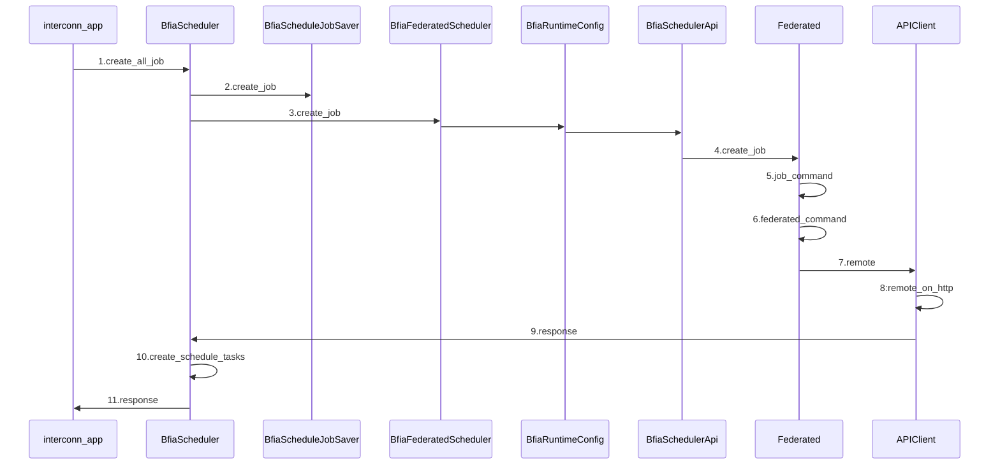
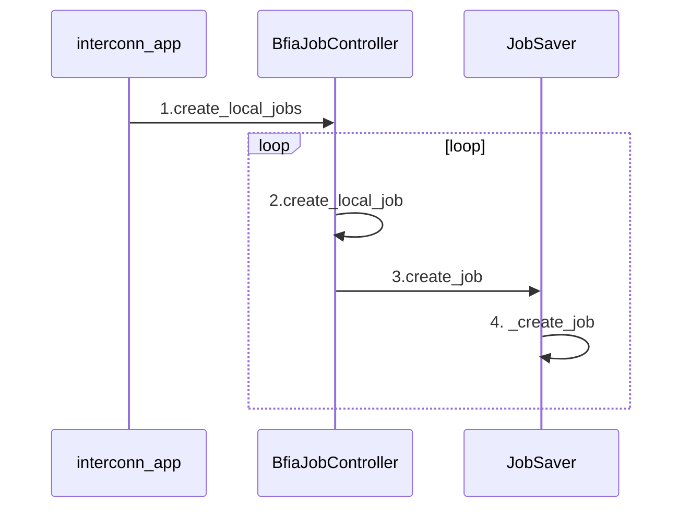
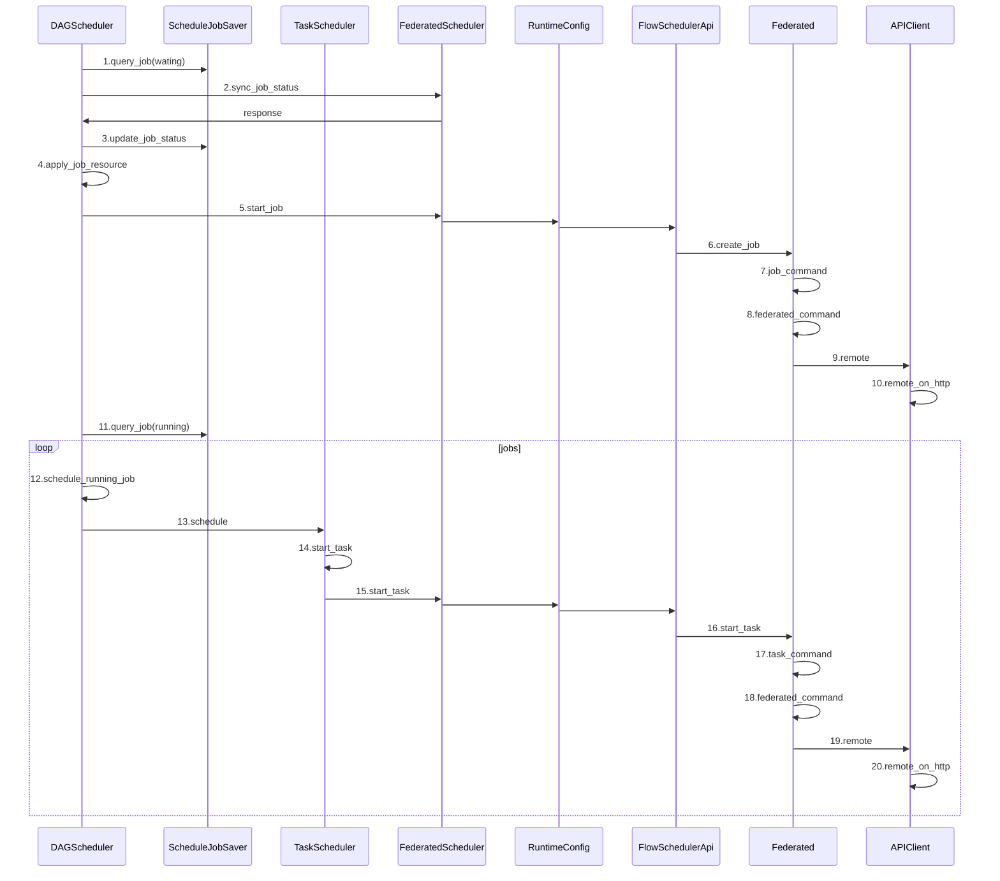
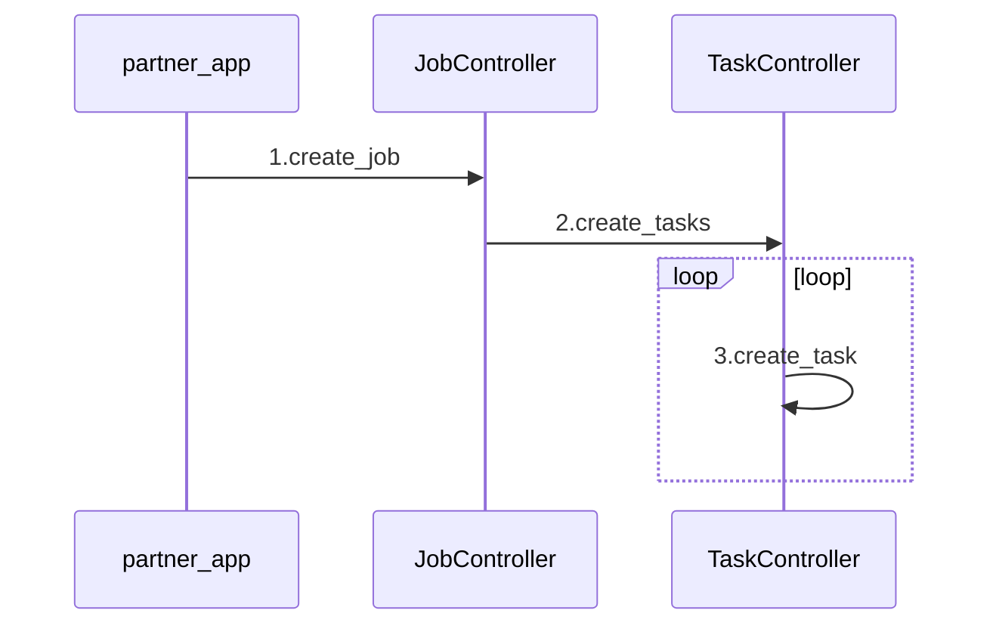
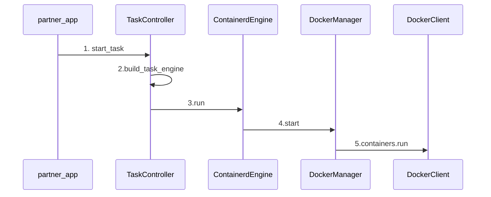

# 算法组件注册
参考[官方文档描述](https://federatedai.github.io/FATE-Flow/latest/zh/provider_register/)

## 说明

FATE Flow设计了算法组件注册模块，以支持多个算法开发厂商、多个版本及多种运行模式。

## 注册（更新）组件

- 文件：`fate_flow/python/fate_flow/apps/client/provider_app.py`

- 接口: `/v2/provider/register`

- 例子：

    请求：
    ```json
    {
        "name": "unionpay",
        "device": "docker",
        "version": "2.0.0",
        "metadata": {
            "base_url": "",
            "image": "unionpay:2.0.0"
        },
        "protocol": "bfia",
        "components_description": {
            "Intersection": {
                "componentName": "Intersection",
                "title": "对齐算法",
                "provider": "unionpay",
                "version": "2.0.0",
                "description": "对齐算法",
                "roleList": [
                    "guest",
                    "host"
                ],
                "desVersion": "1.3.0",
                "storageEngine": [
                    "s3",
                    "hdfs"
                ],
                "inputParam": [
                    {
                        "name": "id",
                        "title": "id列",
                        "description": "id字段名",
                        "type": "string",
                        "optional": "true",
                        "defaultValue": "x1",
                        "validator": "regular-正则项",
                        "UIPattern": "editeable",
                        "groupTag": "默认分组-显示",
                        "UIType": "input"
                    },
                    {
                        "name": "intersect_method",
                        "title": "对齐方式",
                        "description": "对齐方式",
                        "type": "string",
                        "optional": "true",
                        "defaultValue": "raw",
                        "validator": "regular-正则项",
                        "UIPattern": "editeable",
                        "groupTag": "默认分组-显示",
                        "UIType": "input"
                    },
                    {
                        "name": "sync_intersect_ids",
                        "title": "同步对齐id",
                        "description": "同步对齐id",
                        "type": "boolean",
                        "optional": "true",
                        "bindingData": [
                            {
                                "label": "是",
                                "value": "true"
                            },
                            {
                                "label": "否",
                                "value": "false"
                            }
                        ],
                        "defaultValue": "true",
                        "validator": "regular-正则项",
                        "UIPattern": "editeable",
                        "groupTag": "默认分组-显示",
                        "UIType": "select"
                    },
                    {
                        "name": "only_output_key",
                        "title": "仅输出id",
                        "description": "仅输出id",
                        "type": "boolean",
                        "optional": "true",
                        "bindingData": [
                            {
                                "label": "是",
                                "value": "true"
                            },
                            {
                                "label": "否",
                                "value": "false"
                            }
                        ],
                        "defaultValue": "true",
                        "validator": "regular-正则项",
                        "UIPattern": "editeable",
                        "groupTag": "默认分组-显示",
                        "UIType": "select"
                    },
                    {
                        "name": "use_hash",
                        "title": "是否使用哈希",
                        "description": "是否使用哈希",
                        "type": "string",
                        "bindingData": [
                            {
                                "label": "是",
                                "value": "true"
                            },
                            {
                                "label": "否",
                                "value": "false"
                            }
                        ],
                        "optional": "true",
                        "defaultValue": "true",
                        "validator": "regular-正则项",
                        "UIPattern": "editeable",
                        "groupTag": "默认分组-显示",
                        "UIType": "input"
                    },
                    {
                        "name": "hash_method",
                        "title": "哈希方法",
                        "description": "哈希方法",
                        "type": "string",
                        "optional": "true",
                        "defaultValue": "sha256",
                        "validator": "regular-正则项",
                        "UIPattern": "editeable",
                        "groupTag": "默认分组-显示",
                        "UIType": "input"
                    },
                    {
                        "name": "salt",
                        "title": "salt",
                        "description": "salt",
                        "type": "string",
                        "optional": "true",
                        "defaultValue": "12345",
                        "validator": "regular-正则项",
                        "UIPattern": "editeable",
                        "groupTag": "默认分组-显示",
                        "UIType": "input"
                    },
                    {
                        "name": "base64",
                        "title": "选择base64",
                        "description": "是否选择base64方式",
                        "type": "string",
                        "bindingData": [
                            {
                                "label": "是",
                                "value": "true"
                            },
                            {
                                "label": "否",
                                "value": "false"
                            }
                        ],
                        "optional": "true",
                        "defaultValue": "true",
                        "validator": "regular-正则项",
                        "UIPattern": "editeable",
                        "groupTag": "默认分组-显示",
                        "UIType": "input"
                    },
                    {
                        "name": "join_role",
                        "title": "参与角色",
                        "description": "参与角色",
                        "type": "string",
                        "optional": "true",
                        "defaultValue": "host",
                        "validator": "regular-正则项",
                        "UIPattern": "editeable",
                        "groupTag": "默认分组-显示",
                        "UIType": "input"
                    }
                ],
                "inputData": [
                    {
                        "name": "train_data",
                        "description": "训练集数据",
                        "category": "dataset",
                        "dataFormat": [
                            "csv",
                            "yaml"
                        ]
                    }
                ],
                "outputData": [
                    {
                        "name": "train_data",
                        "description": "训练集数据",
                        "category": "dataset",
                        "dataFormat": [
                            "csv"
                        ]
                    },
                    {
                        "name": "train-intersection",
                        "description": "对齐数",
                        "category": "report",
                        "dataFormat": [
                            "csv"
                        ]
                    }
                ],
                "result": [
                    {
                        "resultCode": "00000000",
                        "resultMessage": "成功"
                    },
                    {
                        "resultCode": "99999999",
                        "resultMessage": "算法执行失败"
                    }
                ]
            },
            "HeteroLR": {
                "componentName": "HeteroLR",
                "title": "纵向逻辑回归算法",
                "provider": "unionpay",
                "version": "2.0.0",
                "description": "纵向逻辑回归算法",
                "roleList": [
                    "guest",
                    "host",
                    "arbiter"
                ],
                "desVersion": "1.2.0",
                "storageEngine": [
                    "s3",
                    "hdfs"
                ],
                "inputParam": [
                    {
                        "name": "id",
                        "title": "id列",
                        "description": "id字段名",
                        "type": "string",
                        "optional": "true",
                        "defaultValue": "x1",
                        "validator": "regular-正则项",
                        "UIPattern": "editeable",
                        "groupTag": "默认分组-显示",
                        "UIType": "input"
                    },
                    {
                        "name": "label",
                        "title": "标签",
                        "description": "label字段名",
                        "type": "string",
                        "optional": "true",
                        "defaultValue": "y",
                        "validator": "regular-正则项",
                        "dependsOn": [],
                        "UIPattern": "editeable",
                        "groupTag": "默认分组-显示",
                        "UIType": "input"
                    },
                    {
                        "name": "penalty",
                        "title": "正则项",
                        "description": "正则项",
                        "type": "string",
                        "bindingData": [
                            {
                                "label": "L1正则",
                                "value": "L1"
                            },
                            {
                                "label": "L2正则",
                                "value": "L2"
                            }
                        ],
                        "optional": "true",
                        "defaultValue": "L2",
                        "validator": "regular-正则项",
                        "UIPattern": "editeable",
                        "groupTag": "默认分组-显示",
                        "UIType": "select"
                    },
                    {
                        "name": "tol",
                        "title": "最小损失值",
                        "description": "最小损失值",
                        "type": "float",
                        "optional": "true",
                        "defaultValue": "0.0001",
                        "validator": "regular-正则项",
                        "UIPattern": "editeable",
                        "groupTag": "默认分组-显示",
                        "UIType": "input"
                    },
                    {
                        "name": "alpha",
                        "title": "惩罚因子",
                        "description": "惩罚因子",
                        "type": "float",
                        "optional": "true",
                        "defaultValue": "0.01",
                        "validator": "regular-正则项",
                        "UIPattern": "editeable",
                        "groupTag": "默认分组-显示",
                        "UIType": "input"
                    },
                    {
                        "name": "optimizer",
                        "title": "优化方法",
                        "description": "优化方法",
                        "type": "string",
                        "bindingData": [
                            {
                                "label": "rmsprop",
                                "value": "rmsprop"
                            },
                            {
                                "label": "sgd",
                                "value": "sgd"
                            },
                            {
                                "label": "adam",
                                "value": "adam"
                            },
                            {
                                "label": "sqn",
                                "value": "sqn"
                            },
                            {
                                "label": "adagrad",
                                "value": "adagrad"
                            }
                        ],
                        "optional": "true",
                        "defaultValue": "rmsprop",
                        "validator": "regular-正则项",
                        "UIPattern": "editeable",
                        "groupTag": "默认分组-显示",
                        "UIType": "select"
                    },
                    {
                        "name": "batch_size",
                        "title": "批量梯度下降样本量",
                        "description": "每轮迭代抽取数据计算梯度的size",
                        "type": "integer",
                        "bindingData": [
                            {
                                "label": "all",
                                "value": "all"
                            },
                            {
                                "label": "2048",
                                "value": "2048"
                            },
                            {
                                "label": "4096",
                                "value": "4096"
                            },
                            {
                                "label": "8192",
                                "value": "8192"
                            }
                        ],
                        "optional": "true",
                        "defaultValue": "2048",
                        "validator": "(0,1000)",
                        "UIPattern": "editeable",
                        "groupTag": "默认分组-显示",
                        "UIType": "select"
                    },
                    {
                        "name": "learning_rate",
                        "title": "学习率",
                        "description": "学习率",
                        "type": "float",
                        "optional": "true",
                        "defaultValue": "0.15",
                        "validator": "regular-正则项",
                        "dependsOn": [
                            "optimizer.sgd",
                            "optimizer.adam"
                        ],
                        "UIPattern": "editeable",
                        "groupTag": "默认分组-显示",
                        "UIType": "input"
                    },
                    {
                        "name": "init_param",
                        "title": "初始化方式",
                        "description": "初始化方式",
                        "type": "string",
                        "optional": "true",
                        "defaultValue": "zeros",
                        "validator": "regular-正则项",
                        "UIPattern": "editeable",
                        "groupTag": "默认分组-显示",
                        "UIType": "input"
                    },
                    {
                        "name": "max_iter",
                        "title": "迭代次数",
                        "description": "迭代次数",
                        "type": "integer",
                        "optional": "true",
                        "defaultValue": "30",
                        "validator": "(0,1000)",
                        "UIPattern": "editeable",
                        "groupTag": "默认分组-显示",
                        "UIType": "input"
                    },
                    {
                        "name": "early_stop",
                        "title": "早停策略",
                        "description": "早停策略",
                        "type": "string",
                        "bindingData": [
                            {
                                "label": "weight_diff",
                                "value": "weight_diff"
                            },
                            {
                                "label": "diff",
                                "value": "diff"
                            }
                        ],
                        "optional": "true",
                        "defaultValue": "weight_diff",
                        "validator": "regular-正则项",
                        "UIPattern": "editeable",
                        "groupTag": "默认分组-显示",
                        "UIType": "select"
                    }
                ],
                "inputData": [
                    {
                        "name": "train_data",
                        "description": "训练集数据",
                        "category": "dataset",
                        "dataFormat": [
                            "csv"
                        ]
                    }
                ],
                "outputData": [
                    {
                        "name": "train_data",
                        "description": "训练集数据",
                        "category": "dataset",
                        "dataFormat": [
                            "csv"
                        ]
                    },
                    {
                        "name": "model",
                        "description": "模型文件",
                        "category": "model",
                        "dataFormat": [
                            "csv"
                        ]
                    },
                    {
                        "name": "train-loss",
                        "description": "loss值",
                        "category": "metric",
                        "dataFormat": [
                            "json"
                        ]
                    }
                ],
                "result": [
                    {
                        "resultCode": "4444",
                        "resultMessage": "算法执行失败"
                    }
                ]
            },
            "HeteroSecureBoost": {
                "componentName": "HeteroSecureBoost",
                "title": "XGBoost算法",
                "provider": "unionpay",
                "version": "2.0.0",
                "description": "XGBoost算法",
                "roleList": [
                    "guest",
                    "host"
                ],
                "desVersion": "1.3.0",
                "storageEngine": [
                    "s3",
                    "hdfs"
                ],
                "inputParam": [
                    {
                        "name": "objective_param",
                        "title": "目标参数",
                        "description": "目标参数",
                        "type": "string",
                        "optional": "true",
                        "bindingData": [
                            {
                                "label": "cross_entropy",
                                "value": "cross_entropy"
                            }
                        ],
                        "defaultValue": "cross_entropy",
                        "validator": "regular-正则项",
                        "UIPattern": "editeable",
                        "groupTag": "默认分组-显示",
                        "UIType": "select"
                    },
                    {
                        "name": "learning_rate",
                        "title": "学习率",
                        "description": "学习率",
                        "type": "float",
                        "optional": "true",
                        "defaultValue": "0.15",
                        "validator": "regular-正则项",
                        "UIPattern": "editeable",
                        "groupTag": "默认分组-显示",
                        "UIType": "input"
                    },
                    {
                        "name": "num_trees",
                        "title": "树个数",
                        "description": "树个数",
                        "type": "integer",
                        "optional": "true",
                        "defaultValue": "5",
                        "validator": "regular-正则项",
                        "UIPattern": "editeable",
                        "groupTag": "默认分组-显示",
                        "UIType": "input"
                    },
                    {
                        "name": "subsample_feature_rate",
                        "title": "子样本率",
                        "description": "子样本率",
                        "type": "integer",
                        "optional": "true",
                        "defaultValue": "1",
                        "validator": "regular-正则项",
                        "UIPattern": "editeable",
                        "groupTag": "默认分组-显示",
                        "UIType": "input"
                    },
                    {
                        "name": "n_iter_no_change",
                        "title": "n轮无变化",
                        "description": "n轮无变化",
                        "type": "boolean",
                        "optional": "true",
                        "bindingData": [
                            {
                                "label": "是",
                                "value": "true"
                            },
                            {
                                "label": "否",
                                "value": "false"
                            }
                        ],
                        "defaultValue": "true",
                        "validator": "regular-正则项",
                        "UIPattern": "editeable",
                        "groupTag": "默认分组-显示",
                        "UIType": "select"
                    },
                    {
                        "name": "tol",
                        "title": "停止容忍度",
                        "description": "停止容忍度",
                        "type": "float",
                        "optional": "true",
                        "defaultValue": "0.0001",
                        "validator": "regular-正则项",
                        "UIPattern": "editeable",
                        "groupTag": "默认分组-显示",
                        "UIType": "input"
                    },
                    {
                        "name": "bin_num",
                        "title": "分位数",
                        "description": "分位数",
                        "type": "integer",
                        "optional": "true",
                        "defaultValue": "32",
                        "validator": "regular-正则项",
                        "UIPattern": "editeable",
                        "groupTag": "默认分组-显示",
                        "UIType": "input"
                    },
                    {
                        "name": "predict_param",
                        "title": "预测参数",
                        "description": "预测参数",
                        "type": "string",
                        "optional": "true",
                        "defaultValue": "{\"threshold\": 0.5}",
                        "validator": "regular-正则项",
                        "UIPattern": "editeable",
                        "groupTag": "默认分组-显示",
                        "UIType": "input"
                    },
                    {
                        "name": "cv_param",
                        "title": "cv参数",
                        "description": "cv参数",
                        "type": "string",
                        "optional": "true",
                        "defaultValue": "{\"n_splits\": 5, \"shuffle\": false, \"random_seed\": 103, \"need_cv\": false}",
                        "validator": "regular-正则项",
                        "UIPattern": "editeable",
                        "groupTag": "默认分组-显示",
                        "UIType": "input"
                    },
                    {
                        "name": "metrics",
                        "title": "计算指标",
                        "description": "计算指标",
                        "type": "string",
                        "optional": "true",
                        "defaultValue": "[\"auc\", \"ks\"]",
                        "validator": "regular-正则项",
                        "UIPattern": "editeable",
                        "groupTag": "默认分组-显示",
                        "UIType": "input"
                    },
                    {
                        "name": "early_stop",
                        "title": "早停策略",
                        "description": "早停策略",
                        "type": "string",
                        "optional": "true",
                        "bindingData": [
                            {
                                "label": "weight_diff",
                                "value": "weight_diff"
                            },
                            {
                                "label": "diff",
                                "value": "diff"
                            }
                        ],
                        "defaultValue": "weight_diff",
                        "validator": "regular-正则项",
                        "UIPattern": "editeable",
                        "groupTag": "默认分组-显示",
                        "UIType": "select"
                    },
                    {
                        "name": "tree_param",
                        "title": "树参数",
                        "description": "树参数",
                        "type": "string",
                        "optional": "true",
                        "defaultValue": "{\"max_depth\": 3}",
                        "validator": "regular-正则项",
                        "UIPattern": "editeable",
                        "groupTag": "默认分组-显示",
                        "UIType": "input"
                    }
                ],
                "inputData": [
                    {
                        "name": "train_data",
                        "description": "训练集数据",
                        "category": "dataset",
                        "dataFormat": [
                            "csv"
                        ]
                    }
                ],
                "outputData": [
                    {
                        "name": "train_data",
                        "description": "训练集数据",
                        "category": "dataset",
                        "dataFormat": [
                            "csv"
                        ]
                    },
                    {
                        "name": "model",
                        "description": "模型文件",
                        "category": "model",
                        "dataFormat": [
                            "csv"
                        ]
                    },
                    {
                        "name": "train-loss",
                        "description": "loss值",
                        "category": "report",
                        "dataFormat": [
                            "json"
                        ]
                    },
                    {
                        "name": "train-auc",
                        "description": "auc ks值",
                        "category": "report",
                        "dataFormat": [
                            "json"
                        ]
                    },
                    {
                        "name": "train-ks",
                        "description": "ks曲线值",
                        "category": "report",
                        "dataFormat": [
                            "json"
                        ]
                    }
                ],
                "result": [
                    {
                        "resultCode": "00000000",
                        "resultMessage": "成功"
                    },
                    {
                        "resultCode": "99999999",
                        "resultMessage": "算法执行失败"
                    }
                ]
            }
        }
    }
    ```

    返回：

    ```json
    {
        "code": 0,
        "message": "update success"
    }
    ```

---

# 上传数据集

文件：`fate_flow/apps/client/data_app.py`

## 客户端-服务器不分离

接口: `v2/component/upload`

```json
{
  "file": "examples/data/breast_hetero_guest.csv",
  "head": true,
  "partitions": 16,
  "extend_sid": true,
  "meta": {
    "delimiter": ",",
    "label_name": "y",
    "match_id_name": "id"
  },
  "namespace": "experiment",
  "name": "breast_hetero_guest"
}
```

- file: 文件路径
- head: 数据是否携带header: true/false
- partitions: 数据存储分区数量
- extend_sid：是否需要生成sid列
- meta：数据的元信息
- namespace && name: 数据在fate的存储表引用

> 在请求体中(json)指定文件路径，这个文件路径是服务器的路径，也就是说文件必须在服务器中存在

## 客户端-服务器分离

接口: `v2/component/upload/file`

这种方式就是<font size=5>form-data</font>方式把文件传到服务器端
除了file的区别，其它的key-value和上一种方式一致

---

# 提交作业

## platform 相关接口（发起方发起创建作业配置，并发送给己方调度层时调用的接口）

文件：`fate_flow/python/fate_flow/adapter/bfia/apps/platform_app.py`

接口：`v2/schedule/job/create_all`

请求包：

```json
{
    "flow_id": "JG0100001100000000",
    "dag": {
        "components": [
            {
                "name": "intersect_rsa_1",
                "componentName": "Intersection",
                "provider": "unionpay",
                "version": "2.0.0",
                "input": [],
                "output": [
                    {
                        "type": "dataset",
                        "key": "train_data"
                    },
                    {
                        "type": "report",
                        "key": "report0"
                    }
                ]
            },
            {
                "name": "hetero_secureboost_1",
                "componentName": "HeteroSecureBoost",
                "provider": "unionpay",
                "version": "2.0.0",
                "input": [
                    {
                        "type": "dataset",
                        "key": "intersect_rsa_1.train_data"
                    }
                ],
                "output": [
                    {
                        "type": "dataset",
                        "key": "data0"
                    },
                    {
                        "type": "model",
                        "key": "model0"
                    },
                    {
                        "type": "report",
                        "key": "report0"
                    },
                    {
                        "type": "report",
                        "key": "report1"
                    },
                    {
                        "type": "report",
                        "key": "report2"
                    }
                ]
            }
        ],
        "version": "2.0"
    },
    "config": {
        "initiator": {
            "role": "guest",
            "node_id": "JG0100001100000010"
        },
        "role": {
            "guest": [
                "JG0100001100000010"
            ],
            "host": [
                "JG0100001100000010"
            ]
        },
        "job_params": {
            "common": {
                "sync_type": "poll"
            },
            "guest": {
                "0": {
                    "resources": {
                        "cpu": -1,
                        "memory": -1,
                        "disk": -1
                    }
                }
            },
            "host": {
                "0": {
                    "resources": {
                        "cpu": -1,
                        "memory": -1,
                        "disk": -1
                    }
                }
            }
        },
        "task_params": {
            "common": {
                "hetero_secureboost_1": {
                    "id": "id",
                    "label": "y",
                    "learning_rate": 0.5,
                    "objective_param": {
                        "objective": "cross_entropy"
                    },
                    "num_trees": 2,
                    "subsample_feature_rate": 1,
                    "n_iter_no_change": "True",
                    "tol": 0.0001,
                    "predict_param": {
                        "threshold": 0.5
                    },
                    "cv_param": {
                        "n_splits": 5,
                        "shuffle": false,
                        "random_seed": 103,
                        "need_cv": false
                    },
                    "metrics": [
                        "auc",
                        "ks"
                    ],
                    "early_stopping_rounds": "",
                    "tree_param": {
                        "max_depth": 5
                    }
                },
                "intersect_rsa_1": {
                    "id": "id",
                    "intersect_method": "rsa",
                    "sync_intersect_ids": true,
                    "only_output_key": false,
                    "rsa_params": {
                        "hash_method": "sha256",
                        "final_hash_method": "sha256",
                        "key_length": 2048
                    }
                }
            },
            "guest": {
                "0": {
                    "intersect_rsa_1": {
                        "dataset_id": "testspace#test_guest"
                    }
                }
            },
            "host": {
                "0": {
                    "intersect_rsa_1": {
                        "dataset_id": "testspace#test_host"
                    }
                }
            }
        },
        "version": "2.0.0"
    }
}
```

返回包：

```json
{
    "code": 0,
    "data": {
        "job_id": "202403211636244626050"
    },
    "msg": "success"
}
```


1. 由客户端发起http请求创建job
2. 接口实现：`fate_flow/adapter/bfia/apps/platform_app.py`中`/v1/platform/schedule/job/create_all`，这个接口中调用BfiaJobController的request_create_job类方法
3. BfiaFederatedScheduler的类方法request_create_job中通过BfiaRuntimeConfig获取到BfiaSchedulerApi对象，BfiaSchedulerApi对象的scheduler属性，返回一个scheduler对象.
4. 再使用这个scheduler对象调用create_job，在这一步指定endpoint，为 <font size=5>/v1/interconn/schedule/job/create_all</font>
5. scheduler_command的调用，参数透传第4步的参数
6. federated_command的调用，参数也基本上就是透传
7. 调用至APIClient中的remote，这一步会判断请求包中的flow_id 是不是己方的id，如果是己方，就往己方的endpoint发；如果非己方，则根据路由表配置，<font size=5>发送http请求至己方和其它参与方的interconn相关接口 </font>。路由表配置文件：`fate_flow/adapter/bfia/conf/route_table.yaml`(以federation使用osx举例)

---

## interconn相关接口(发起方向调度方发送创建作业请求时调用的接口)

文件：`fate_flow/adapter/bfia/apps/interconn_app.py`

接口：`/v1/interconn/schedule/job/create_all`



1. 接收到来自发起方的创建作业请求，调用`BfiaScheduler`的`create_all_job`
2. `BfiaScheduler`的`create_all_job` 会解析`DAG`,获取作业的参与方等信息，调用`BfiaScheduleJobSaver`保存作业信息到<font size=5>t_schedule_job</font>中
3. 调用`BfiaFederatedScheduler`的`create_job`
4. 调用`Federated`对象的`create_job`
5. 调用`Federated`对象的`job_command`, 指定endpoint为<font size=5>/v1/interconn/schedule/job/create</font>
6. 调用`Federated`对象的`federated_command`
7. 调用`APIClient`对象的`remote`
8. 调用`APIClient`对象的`remote_on_http`,<font size=5>发送http请求至endpoint相关接口 </font>,这里有一点，就是目的节点id是己方id时，不需要指定`host`,`port`；否则从路由表中找到目的节点id对应的host和port信息，再调用`remote_on_http`(指定host和port),这个请求被`fate_flow/adapter/bfia/apps/interconn_app.py`接收

---

文件：`fate_flow/adapter/bfia/apps/interconn_app.py`

接口：`/v1/interconn/schedule/job/create`



最后Job信息被保存到<font size=5>t_job</font>表中

# 执行作业




1. 定时器取出<font size=5>t_schedule_job</font>表中wating状态的作业（会有优先级以及创建时间的排序规则）
2. 在作业集中取第1个作业和其它参与方同步作业的状态
3. 如果是有其它参与方取消了作业，那就把作业状态同步过来，更新作业状态为canceled。这一步如果状态为canceled，则直接返回了
4. 如果状态不为canceled，则申请资源
5. 调用FederatedScheduler的start_job 
6. 调用Federated的create_job(fate_flow/python/ofx/api/models/fate_flow/federated.py)
7. 调用Federated的job_command
8. job_command 调用federated_command
9. federated_command会调用APIClient的remote
10. remote调用remote_on_http，<font size=5>发送http请求至endpoint相关接口 </font>,这里有一点，就是目的节点id是己方id时，不需要指定`host`,`port`；否则从路由表中找到目的节点id对应的host和port信息，再调用`remote_on_http`(指定host和port)，请求会被发送至`fate_flow/python/fate_flow/apps/partner/partner_app.py`,调用partner_create_job

11. 查询出状态为running的作业（这个时候状态已经同步过了）

20. 把http请求发送至`fate_flow/python/fate_flow/apps/partner/partner_app.py`,调用start_task


# 附：

## 第10步的更多细节



## 第20步的更多细节




